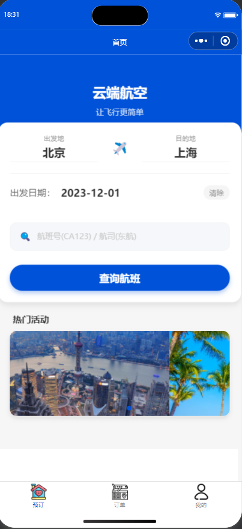
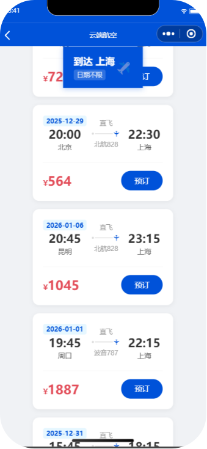
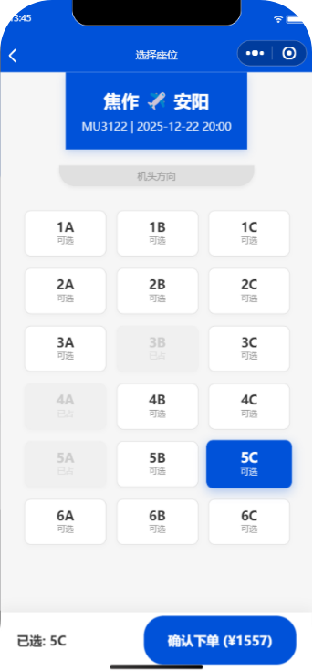
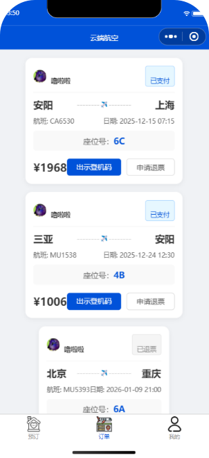
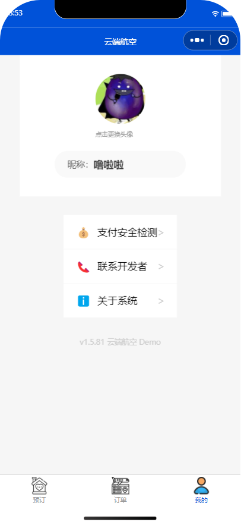

# ✈️ 云端航空 (Cloud Air) - 在线票务预定系统

<!-- 这里放你的仓库二维码，如果没有可以删掉这一段 -->
<p align="center">
  
</p>

> 基于微信小程序 + 微信云开发 (Serverless) 构建的航空票务全流程演示系统。
> 软件工程课程实训大作业。

## 📖 项目介绍

本项目模拟了真实的航空订票流程，实现了从航班查询、可视化选座、订单生成到电子登机牌生成的完整业务闭环。系统采用 Serverless 架构，无需搭建传统后端服务器，数据实时同步云端。

## ✨ 核心功能

*   **🔍 智能混合搜索**：支持“日期+地点”精确查询，及“航班号/航司/机型”正则模糊检索。
*   **💺 可视化选座**：模拟真实机舱布局，实现高并发下的“锁座”与“防超卖”事务控制。
*   **📋 订单全周期管理**：涵盖下单、模拟支付、查看详情、申请退票（库存自动回滚）。
*   **🎫 电子登机牌**：基于 Canvas 动态生成登机二维码。
*   **👤 用户中心**：微信头像昵称同步、本地缓存登录态管理。

## 🛠️ 技术栈

*   **前端框架**：微信小程序原生 (MINA)
*   **后端支撑**：微信云开发 (Cloud Base)
*   **数据库**：云数据库 (NoSQL JSON Database)
*   **核心逻辑**：JavaScript (ES6+), Promise, Async/Await
*   **工具库**：weapp-qrcode (二维码生成)

## 📂 项目目录结构

```text
CloudAir-Ticket-System/
├── miniprogram/                  // 小程序核心代码目录
│   ├── images/                   // 图片资源（Banner、图标、二维码）
│   ├── pages/                    // 页面文件
│   │   ├── index/                // 首页（混合搜索、轮播图）
│   │   ├── flight-list/          // 航班列表页（正则查询、动态渲染）
│   │   ├── seat-select/          // 选座页（CSS Grid布局、事务锁座）
│   │   ├── order-list/           // 订单页（状态流转、退票逻辑）
│   │   ├── profile/              // 个人中心（登录同步、弹窗交互）
│   │   └── boarding-pass/        // 电子登机牌（Canvas绘图）
│   ├── utils/                    // 工具类（二维码生成库）
│   ├── app.js                    // 全局逻辑（云环境初始化、数据脚本）
│   ├── app.json                  // 全局配置（页面路由、TabBar）
│   └── app.wxss                  // 全局样式
├── cloudfunctions/               // 云函数根目录（预留）
├── project.config.json           // 项目工程配置文件
└── README.md                     // 项目说明文档
```

## 📸 系统截图

| 首页搜索 | 航班列表 | 在线选座 |
| :---: | :---: | :---: |
|  |  |  |

| 订单管理 | 电子登机牌 | 个人中心 |
| :---: | :---: | :---: |
|  |  |  |

## 🚀 快速开始

1.  **克隆项目**
    ```bash
    git clone https://github.com/你的用户名/CloudAir-Ticket-System.git
    ```
2.  **导入工具**
    打开微信开发者工具，导入项目目录。
3.  **配置云环境**
    *   开通云开发环境。
    *   在 `miniprogram/app.js` 中替换 `env` 为你的环境 ID。
4.  **初始化数据库**
    *   在云控制台创建 `flights`, `seats`, `orders`, `users` 四个集合。
    *   修改数据库权限为“所有用户可读，仅创建者可读写”。
    *   (可选) 使用项目中的脚本注入测试数据。
